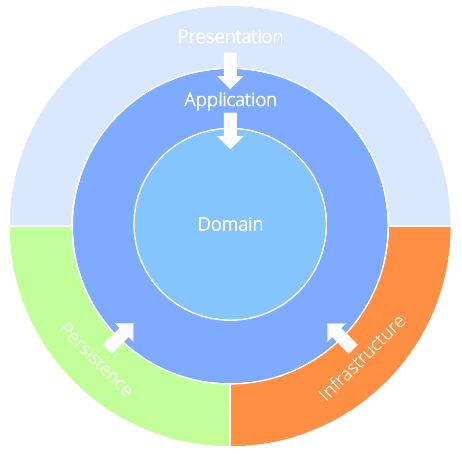

# Template Structure

## Domain Layer
- Third Party Libraries
  - None

## Application Layer
- Third Party Libraries
  - MediatR
  - Microsoft.Data.SqlClient
  - Microsoft.EntityFrameworkCore
  - Microsoft.EntityFrameworkCore.SqlServer
  - Microsoft.IdentityModel.JsonWebTokens
  - System.IdentityModel.Tokens.Jwt

## Presentation Layer
### Presentation.API
- Third Party Libraries
  - Microsoft.AspNetCore.Authentication.JwtBearer
  - Microsoft.AspNetCore.OpenApi
  - Microsoft.VisualStudio.AzureContainers.Tools.Targets
  - Scalar.AspNetCore
  
### Presentation.Console
- Third Party Libraries
  - Microsoft.Extensions.Hosting
  - Spectre.Console
  - Spectre.Console.Cli

### Presentation.Web
- Third Party Libraries
  - Microsoft.VisualStudio.AzureContainers.Tools.Targets
  - MudBlazor
  
## Persistence Layer
- Third Party Libraries
  - Microsoft.EntityFrameworkCore
  - Microsoft.EntityFrameworkCore.SqlServer
  - Microsoft.Extensions.DependencyInjection.Abstractions

## Infrastructure Layer
- Third Party Libraries
  - Azure.Identity
  - Microsoft.Extensions.Diagnostics.HealthChecks.Abstractions

## Testing Layer
- Third Party Libraries
  - coverlet.collector
  - FakeItEasy
  - Microsoft.NET.Test.Sdk
  - NetArchTest.Rules
  - NUnit
  - NUnit.Analyzers
  - NUnit3TestAdapter