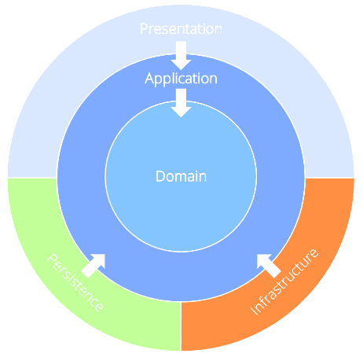

# Template Structure

## Domain Layer
- Third Party Libraries
  - None

## Application Layer
- Third Party Libraries
  - Microsoft.EntityFrameworkCore
  - Microsoft.Extensions.Hosting

  CQRS dispatch (`ISender`, request/handler contracts, pipeline behaviors) is a small in-house
  implementation in `Application/Sender.cs` and `Application/Abstractions/`, rather than a
  third-party mediator library — see `IRequestHandler<,>`, `IQueryHandler<,>`,
  `ICommandHandler<,>`, and `IPipelineBehavior<,>`.

## Presentation Layer
### Presentation.API
- Third Party Libraries
  - Microsoft.AspNetCore.OpenApi
  - Microsoft.OpenApi
  - Microsoft.VisualStudio.Azure.Containers.Tools.Targets
  - Scalar.AspNetCore
  
### Presentation.Console
- Third Party Libraries
  - Microsoft.Extensions.Hosting
  - Spectre.Console
  - Spectre.Console.Cli

### Presentation.Web
- Third Party Libraries
  - Microsoft.VisualStudio.Azure.Containers.Tools.Targets
  - MudBlazor
  
## Persistence Layer
Persistence is split into a provider-agnostic core and one project per database platform.
The core never references a concrete provider; each host opts providers in at its
composition root.

### Persistence (core)
- Third Party Libraries
  - Dapper
  - Microsoft.EntityFrameworkCore.Relational
  - Microsoft.EntityFrameworkCore.Design

  Owns the DbContexts, Dapper repositories, connection factories, the `IDatabaseProvider`
  port and the `DatabaseProviderRegistry`. The active provider is selected per
  query/command side via `DatabasePlatformOptions` in each Presentation project's
  `appsettings.json` and resolved from the registry at startup; an unregistered
  platform fails fast with the list of registered ones.

### Persistence.SqlServer / Persistence.PostgreSql / Persistence.MySql
| Project | Platform key | Third Party Libraries |
|---|---|---|
| `Persistence.SqlServer` | `MSSQL` | Microsoft.EntityFrameworkCore.SqlServer, Microsoft.Data.SqlClient |
| `Persistence.PostgreSql` | `PostgreSQL` | Npgsql.EntityFrameworkCore.PostgreSQL, Npgsql |
| `Persistence.MySql` | `MySQL` | MySql.EntityFrameworkCore, MySqlConnector |

  Each project exposes a single public registration extension; its `IDatabaseProvider`
  implementation is internal. Hosts register every platform either side may be configured for:

```csharp
builder.AddPersistenceRegistrations(providers =>
{
    providers.AddSqlServer();
    providers.AddPostgreSql();
    providers.AddMySql();
});
```

  To drop a platform, remove its `Add…()` call and its project reference from each host.
  `PersistenceArchitectureTests` enforce that the core stays provider-agnostic and that
  provider projects don't reference each other.

## Infrastructure Layer
- Third Party Libraries
  - Azure.Identity
- Framework References
  - Microsoft.AspNetCore.App (needed for `GlobalExceptionHandler` and the
    health check response writer, both of which are ASP.NET Core-specific
    cross-cutting concerns centralized in this layer)

## Testing Layer
- Third Party Libraries
  - coverlet.collector
  - FakeItEasy
  - Microsoft.NET.Test.Sdk
  - NetArchTest.Rules
  - NUnit
  - NUnit.Analyzers
  - NUnit3TestAdapter

# Versioning

The solution follows [Semantic Versioning 2.0](https://semver.org). Versions are calculated at
build time by [MinVer](https://github.com/adamralph/minver) from git tags, so there are no version
numbers to edit in any project file. The configuration lives in `source/Directory.Build.props`, and
every project gets the same version.

| Git state | Version |
|---|---|
| No tags yet | `1.0.0-alpha.0.{height}` |
| Commit tagged `v1.4.0` | `1.4.0` |
| 3 commits after `v1.4.0` | `1.4.1-alpha.0.3` |
| Commit tagged `v1.5.0-rc.1` | `1.5.0-rc.1` |
| 2 commits after `v1.5.0-rc.1` | `1.5.0-rc.1.2` |

`{height}` is the number of commits since the last tag, so every build has a unique version that
sorts correctly. The assembly attributes are set as follows:

- `AssemblyInformationalVersion` is the full version plus build metadata (the commit SHA), e.g.
  `1.4.1-alpha.0.3+2057147a69…`.
- `FileVersion` is `{Major}.{Minor}.{Patch}.0`.
- `AssemblyVersion` is `{Major}.0.0.0`, so it only changes on a breaking (major) release.

## Cutting a release

```bash
git tag v1.4.0          # or a pre-release: git tag v1.5.0-rc.1
git push origin v1.4.0
```

Choose the number by the SemVer rules: MAJOR for breaking changes, MINOR for backward-compatible
features, PATCH for backward-compatible fixes. Tags must start with `v`.

## Where the version appears

- The `/health` response includes `version` and `informationalVersion`.
- The API's OpenAPI document (`/openapi/v1.json`, shown in Scalar) uses the version as `info.version`.
- Every host (API, Web, Console) logs `Starting {Application} {Version} … in {Environment}` at startup.
- In code, inject `ONIONARCH.Infrastructure.Versioning.ApplicationVersion` (a singleton) or use
  `ApplicationVersion.Current`.

## CI and Docker

- The GitHub Actions workflow (`.github/workflows/build.yml`) checks out with `fetch-depth: 0`. MinVer
  needs the tags and history, and a shallow clone would make every build look untagged.
- Docker builds have no `.git` in their context, so the version is passed in as a build argument.
  Without it the image is built as `1.0.0-alpha.0` and MinVer logs warning `MINVER1001`.

  ```bash
  docker build source -f source/ONIONARCH.Presentation.API/Dockerfile --build-arg APP_VERSION=1.4.0
  ```

  The image also gets an `org.opencontainers.image.version` label.
- Any other build can force a version with `-p:MinVerVersionOverride=1.4.0`.
# Documentation

API documentation is generated as Markdown from the XML documentation comments (`///`) with
[DocFX](https://dotnet.github.io/docfx/). The configuration lives in `Documentation/DocFX`.

- On every push to `main`, the `Documentation` workflow (`.github/workflows/docs.yml`) generates the
  pages and publishes them to [Vercuski/RepoDocumentation](https://github.com/Vercuski/RepoDocumentation)
  under a folder named after this repository (`ONIONARCH.Template/`), where GitHub renders them
  directly: a `README.md` landing page (from `Documentation/DocFX/landing-page.md`) and one page per
  namespace and type under `api/`.
- DocFX's Markdown output leaves `<see cref="..."/>` references unresolved, so
  `Documentation/DocFX/PostProcess.cs` (a .NET 10 file-based app) turns them into links. It fails the
  build on any broken link or anchor, and DocFX runs with `--warningsAsErrors`, matching
  `TreatWarningsAsErrors` for code.
- Publishing requires a `DOCS_REPO_TOKEN` secret: a fine-grained personal access token with
  **Contents: Read and write** on `Vercuski/RepoDocumentation` only.
- To generate the same output locally (written to `Documentation/DocFX/_site`):

  ```bash
  dotnet tool install --global docfx
  cd Documentation/DocFX
  docfx metadata docfx.json
  dotnet run PostProcess.cs
  ```
